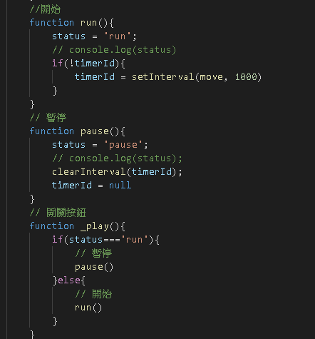

## 模仿自:
https://github.com/HarryChen0506/js-tetris

複製90%、10原創(背景、音樂、方塊顏色、操控)
## 功能:

1.A跟D鍵來控制方塊的水平移動

2.W鍵來控制方塊旋轉

3.S鍵來加快下落速度

4.空白鍵可以讓方塊直接落下

5.依照一次性消除的行數來決定給多少分，一次消除1行給10分、消除2行給30分、消除3行給60分、消除4行給80分

6.Q鍵可以暫停與開始

7.顯示當前方塊的執行狀態

8.預覽下一顆方塊

9.可以自行修改遊戲區域的起始狀態與大小

10.添加了音樂播放器

## 可以加強的地方:

1.背景部分可以多一些美術

2.死亡時沒有結束畫面

3.只能用F5來重新開始遊戲

4.UI太過簡潔，可以設定一些按鈕(結束遊戲、重新開始)

5.遊戲區域太小

6.音樂沒辦法自動播放